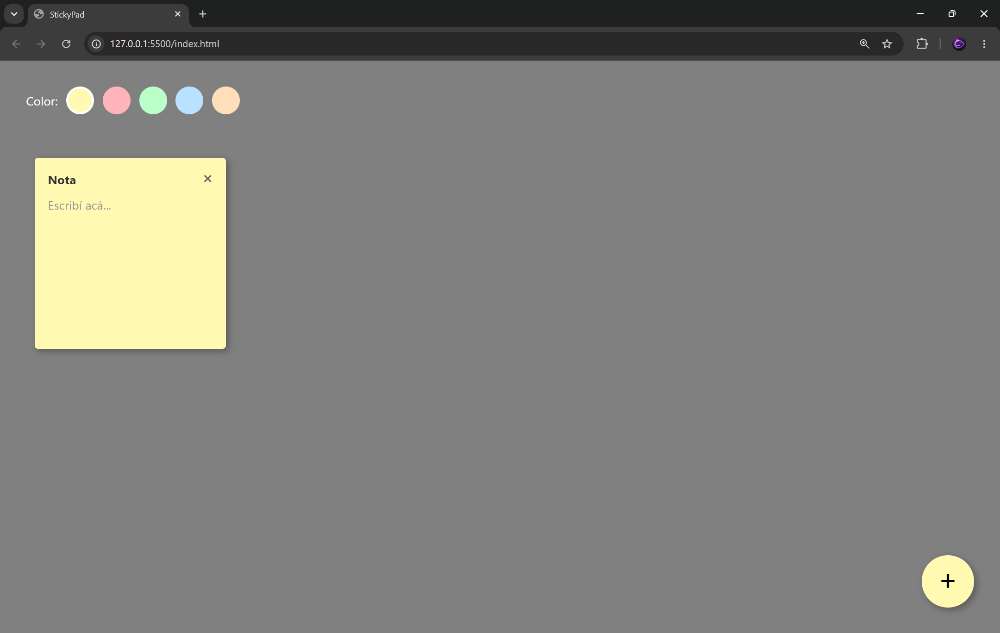

# StickyPad

Aplicación de notas tipo post-it creada con HTML, CSS y JavaScript puro.

## Características

- 📌 Crear notas con el botón "+"
- 🎨 5 colores para elegir (amarillo, rosa, verde, azul, naranja)
- ✏️ Escribir y editar notas
- 🖱️ Arrastrar notas por la pantalla
- 🗑️ Borrar notas con el botón "×"
- 💾 Guardado automático en localStorage

## Tecnologías

- HTML5
- CSS3 (Grid, Flexbox)
- JavaScript vanilla

## Uso

1. Abrí `index.html` en tu navegador
2. Elegí un color de la barra superior
3. Hacé click en "+" para crear una nota
4. Escribí tu nota
5. Arrastrala a donde quieras

## Pagina
https://sticky-pad.vercel.app/

## Imagen
